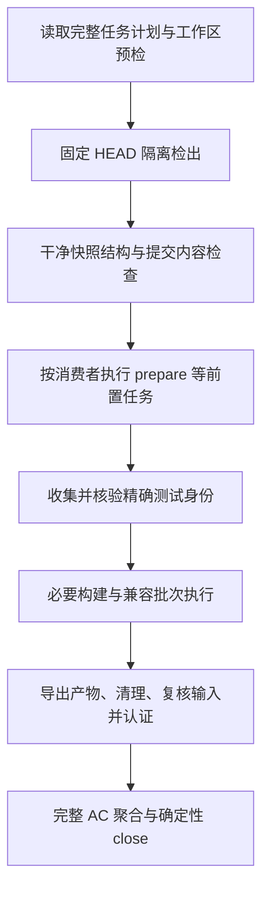

# Harness 执行与验收成本改造方案

2026-09-06，状态为待评审。改造对象是 Harness 的计划解析、初始化、测试调度、诊断、证据与关闭流程；公开页面只是实测工作负载，不是本方案的产品改造对象。本次只编写方案，不修改 CLI 运行行为，也不启用结果复用。

来源：[用户请求对应的显式摩擦事件](../events/20260906-public-reading--workflow-friction_confirmed.json)、[第三阶段记录](../../../plan-build/ui-improvement/design/PHASE-3.md)、[正式验收证据](../../verification/evidence/20260906-public-reading.json)。源码审查基线为 `d743082`；实测成功运行的产品和 Harness 源提交为 `fb9f06fa1a2a4f73830627f580f3f9fb0ed6fe43`。

本方案在已实施的[受影响模块验证决策](../../docs/decisions/20260905-verification-resume.md)上增量改造。现有按影响选择测试、认证账本、失败阻断、隔离和确定性关闭均保留，不恢复旧的全目录门禁，不重做已经完成的能力。方案经确认后，实施任务再按 [SDD](../../specs/_sdd/README.md)建立 active spec、影响计划及精确验收映射；本文不是已生效的运行规范。

## 1. 问题判断与实测依据

测试范围、执行次数和运行成本是三个问题。第三阶段覆盖十类公开页面，最终选中 18 个 case、42 个测试引用，排除 135 个 case，说明影响选择已经发挥作用。42 项中仅 4 项是本次新增；14 项检查包含产品门禁，80 张截图属于产物，不应把这些数量相加。

从本地认证账本逐轮核对得到：

| 运行 ID 前缀 | 结果与原因 | 应在何处处理 |
| --- | --- | --- |
| `13dfa0d4`、`f78af245` | Nuxt 默认生成目录缺失，连续两次服务启动超时 | 执行配置的显式初始化合同；第一次失败后先诊断 |
| `b8537da0` | axe 扫描到 Nuxt 开发错误调试浮层 | 产品页面与开发工具的检查边界，保留生产全页扫描 |
| `acf6b0a8` | 断点切换中两次布局读取不一致；主工作区同时改变验证输入 | 稳定测量和正式运行期间的输入冻结 |
| `daf44a60` | 旧测试引用已移除的首页容器 | 所选测试的局部回归和断言维护 |
| `54df40ca` | 空归档假设隔离库为空，但前组已发布样例 | 测试数据前提与清理合同 |
| `004b0f66` | 42 项产品测试通过，末尾才发现提案链接的素材不在 Git 中 | 干净快照中的结构检查前置 |
| `94e2f43a` | 全部通过并关闭 | 正式成功基线 |

共 8 轮正式验证；Web 质量组执行 6 次且均通过，E2E 执行 8 次，隔离内 Harness 完整性组执行 2 次。门禁累计耗时约 1,988.4 秒（33.1 分钟），不包含前期本地诊断、完整单元测试、修改代码及人工看图的时间。原始账本位于本机 Harness run store，文件名为 `20260906-public-reading.json`；原始日志及认证材料不复制入 Git。

最终单轮的可比较数据：

| 指标 | 实测 |
| --- | --- |
| 完整验证墙钟 | 470.1 秒；14 项检查全通过 |
| Web 质量 | 123.2 秒；12 项选定测试通过 |
| E2E | 343.8 秒；30 项测试通过，拆为 12 个 Playwright 进程，API 启动 12 次 |
| E2E 用例报告耗时之和 | 约 131.4 秒；含用例内部的导航、等待和截图 |
| E2E 门禁与用例耗时差 | 约 212.4 秒、62%；包含收集、启停、框架和监督进程等开销，现有日志不能进一步精确归因 |
| 隔离内 Harness 完整性 | 约 1.1 秒 |

这是一台 Windows 机器上的一次成功样本，不是普遍性能结论。优先消除无效正式运行和重复进程启动，不凭测试数量删减必要断言。执行者过早启动整轮验收、未集中处理测试前提，以及误把本地设计材料纳入 Git，也应通过工作流程纠正，不能归咎于 Harness 配置一项。

## 2. 现有能力与实际缺口

| 当前实现 | 保留内容 | 改造缺口 |
| --- | --- | --- |
| [verify 入口](../../tools/harness.py)先执行全局结构检查，失败会阻止产品门禁 | 便宜失败前置 | 检查当前工作区会被本地未提交素材满足；[隔离层](../../tools/isolated_verification.py)建立 worktree 后目前直接执行 gates |
| [初始化与环境检查](../../tools/verification_inputs.py)已检查依赖目录、命令、端口 | 受控环境、端口归属和隔离 | Nuxt prepare 仅绑定 [Vitest 分支](../../tools/selected_tests.py)，普通 E2E 隐含依赖另一 gate 先运行 |
| [精确选择器](../../tools/selected_tests.py)按 JavaScript 文件分组 | 防止文件与测试名交叉扩张 | 12 个文件重复收集及启动服务；执行结果主要按总数比对 |
| 整个 gate 共用 `GAVIN_E2E_RUN_ROOT` | 测试不接触开发库 | 重启服务不重置数据库；独占全局状态的测试与可共享测试没有显式区别 |
| [复用默认关闭](../../config.toml)，现有可复用资格限于有界 Harness Pytest | 明确的信任和成本边界 | 当前身份绑定 HEAD、整个任务计划和指纹；不是按门禁消费依赖的跨提交复用 |
| [close](../../tools/verification_resume.py)只消费认证结果并执行结构事务检查 | 锁、journal、失败记录、digest 与回滚 | 不需要再设计一个“免测试 close”；重复主要发生在多次 verify |

产品任务最后修改文档，仍然包含此前的产品变化，不能把 baseline→HEAD 的影响计划缩成最后一次提交的文档范围。独立纯文档任务可以只选结构检查；产品任务中免跑已验证部分，需要另外证明历史结果仍然适用。

## 3. 目标、非目标与分期

目标：保持相同影响范围和精确覆盖，减少无效正式运行、重复服务启动及无法解释的耗时；每次运行明确展示准备、收集、执行、复用、失败、未执行和关闭状态。

本轮不改产品 UI、业务 API、数据模型、助手准入或部署流程；不提高超时掩盖错误，不自动安装依赖，不启用全局缓存，不引入远程执行/缓存服务，不自动修改 `AGENTS.md`，不重写旧 archive/evidence/event。

| 阶段 | Harness 交付 | 进入下一阶段的条件 |
| --- | --- | --- |
| A：干净快照预检与初始化 | 在昂贵执行前证明 Git 快照完整，执行显式 prerequisite | 缺链接或初始化失败时产品测试调用为零；普通 E2E 无需借用 web-quality 初始化 |
| B：局部诊断与失败处理 | 非认证诊断入口、分类失败、固定输入纪律、分组产物保存 | 诊断不能关闭任务；局部失败可以在不重跑完整范围下被定位 |
| C：精确身份与兼容批处理 | 完整身份、收集/执行集合核验、数据隔离策略、同批共享服务 | 无扩张/遗漏/顺序依赖；相同工作负载实测启动数及墙钟减少 |
| D：认证复用输入合同 | 先影子判定，再决定有界资格和跨提交复用 | 依赖完整、负向失效通过、核验成本低于实测收益；否则保持关闭 |

A–C 是优先交付范围；不以 D 的复杂复用设计阻塞前三阶段。D 需独立评审与实施规格，不把“文档提交后无需重跑产品”提前作为已实现承诺。

## 4. 阶段 A：干净快照预检与显式初始化

建议正式执行链如下；是拟议内部阶段，不要求新增对应的用户命令：

1. 保留工作区预检，并明确标为工作区结果。隔离检出后、任何 collector/prepare/build/产品测试启动前，执行快照的结构、链接、元数据、索引、归属和任务输入检查；需要生成产物的检查归入后续前置任务，不混入纯结构检查。
2. 持久文档的相对链接必须能由提交内容满足；开发机存在且被忽略的文件不能替代。原始日志/截图以明确的本地材料位置记录，不能为通过检查提交重型文件，也不能一律忽略 Markdown 链接。
3. 将本次真实执行的干净快照结构结果映射到 `harness-integrity`，避免在同一不变快照中仅为 gate 排序重复执行。close 的 archive/event/index 前后检查针对新的事务状态，仍然执行。
4. 从所选执行配置推导 prerequisite，而不是从测试文件顺序推导。每项声明 ID、规范命令/cwd、消费者、环境、输出目录、输入摘要和失败类型；相同隔离上下文内执行一次。
5. 普通 Nuxt E2E 显式依赖 Nuxt prepare；生产预览另依赖对应 build；assistant、failure、普通 dev 的构建/开关合同分别维护。Harness-only 任务不启动 Node；初始化不能夹带一组无关产品测试。
6. prerequisite 失败后标记消费者为 `not-run`，保留初始化日志；不把两分钟服务超时当作正常检测生成文件缺失的方法。端口冲突不接管或终止外部服务。

## 5. 阶段 B：局部诊断与正式认证分开

下列 `diagnose` 接口是拟议命令；现有 `plan`、`status`、`verify`、`close` 的名称和主要职责保留：

| 命令 | 语义 |
| --- | --- |
| `plan TASK` / `status TASK` | 只读说明完整所选范围、前置任务、批次、历史失败及成本；不暗中运行 collector 或构建 |
| `diagnose TASK --case CASE` | 从当前完整计划中选该 case 的精确引用，局部诊断；不改 task 的正式所选集合 |
| `diagnose TASK --failed` | 将上次失败身份与当前计划匹配；若失败发生在初始化/收集/服务启动阶段，则由可信阶段或批次记录还原受影响消费者的精确子集；引用消失、歧义或无法还原时报告缺口，不静默选空或扩大为整个 gate |
| `verify TASK --close` | 固定最终输入，执行完整正式计划并同进程关闭；默认继续不复用 |
| `verify TASK --fresh` | 明确重跑完整任务所选范围；不等同 release |

首版诊断仍使用固定 HEAD 的隔离检出和受控依赖，降低模式数量；未提交修改的快速试验继续使用已有局部测试命令。若以后支持工作区诊断，必须单独标明 dirty diff 身份、产物和无认证资格，不能悄悄退回读取开发数据库。

诊断结果放入独立本地命名空间，不覆盖正式 evidence，不生成可关闭 aggregate，不冒充正式通过。在默认不复用阶段，正式认证仍会完整执行。进入 D 后，受控 runner 报告的同门禁身份诊断失败也必须阻断更早通过的复用；诊断成功本身不授予关闭资格。

建议流程为：明确失败类型 → 局部复现 → 修复前提或实现 → 局部检查通过 → 提交完整输入 → 正式验收。正式运行中修改源码或所要求文档，继续使认证失败；执行者应等待该轮完成，或显式取消并完成清理后修改。

失败分类至少区分：快照/输入、初始化、精确收集、服务启动、业务断言、结果身份不匹配、输入漂移、产物导出、清理与关闭事务。分类必须有 runner 来源，启发式日志摘要只作提示；不自动把断言失败改判为环境失败，不自动无限重试。

每个 batch 使用 `run_id/gate/batch_id` 独立产物目录，并交给现有有界导出/清理流程。下一次 Playwright 调用不能清掉上一组截图；取消依赖外部 watcher 抢拷贝的做法。保留现有本地容量和保留期限，Git 只保存紧凑清单。

## 6. 阶段 C：精确身份、数据合同和批量执行

### 6.1 先升级身份，再合并进程

当前引用主要绑定文件与叶标题。建议规范身份为 `(kind, config, project, repository_path, title_path[])`，其中 `title_path` 包含全部 describe 层级与叶标题；路径规范化需覆盖 Windows。runner 提供的 ID 可作为本次运行佐证，不单独当作跨版本稳定 ID。

旧引用通过 collector 唯一解析到新身份；相同叶标题有多个候选时阻断，要求显式补齐。schema、identity 和认证版本的变化必须明确失效旧凭据；历史只读记录保持兼容，不批量改写旧证据。

当前锁定的 Playwright 1.62.1 已提供公开 `--test-list`。实施时可使用其逐行文件/项目/完整标题选择能力，但它的文本分隔符及标题路径前缀匹配不是天然的精确身份保证：

- 生成选择文件后，在同一固定快照中收集，要求 `collected identities == selected identities`，重复、缺失和扩张均失败。
- 使用结构化 reporter 核验 `executed identities == selected identities`，全部通过、零重试、无 skip/fixme/todo；“数量相同但身份不同”也必须拒绝。
- 不把文件列表和标题列表分别做 OR。含换行、分隔符或无法无损表达的身份使用经同样集合核验的逐文件回退；不能保证精确时明确失败。
- 只使用公开 CLI/reporter 能力，不依赖 Playwright 私有 runner API。升级依赖版本时重验选择语义。

### 6.2 批次兼容性必须显式

分组键至少包括 gate、config、project、受控环境/前置任务合同、服务合同和数据隔离类型。普通 dev、production quality、assistant 和 failure upstream 不混为一组；不以“都使用 Playwright”作为合并依据。

同批次共享它自己启动的 API/Nuxt；跨运行不复用服务，仍保留单 worker、零自动重试与 `reuseExistingServer: false`。服务复用只减少本次进程开销，与认证结果复用是两项独立能力。

### 6.3 数据隔离不能靠服务重启

Harness 为每批分配独立 runtime root，显式声明可共享、独占全局状态或未声明策略。应用测试通过既有测试 fixture 建立自己的前提，记录并清理自己创建的数据；测试前提不能依赖其他文件先运行。

需要“数据库全空”、修改全局 profile、删除整类数据的测试先放入独占隔离批次。独占默认粒度是单个完整测试身份，不能因为同为 `exclusive` 就合并；只有已经证明每例前恢复完整基线的显式隔离组才能整体成批。未声明策略同样按单身份保守隔离，不推断同文件安全共享；逐文件回退也必须明确数据根，不能延续“服务重启即清库”的错误假设。逐项验证独立、批量与不同顺序结果一致后，才扩大共享批次。

不向生产 API 添加测试 reset 接口，不直接替换运行中 SQLite 文件。若某套产品 fixture 尚未支持安全共享，保留其独占成本并报告原因；Harness 改造不能以修改产品业务语义换取测试速度。

## 7. 阶段 D：认证复用先证明输入完整，再启用

本阶段独立于 A–C，初始保持 `reuse=false`。当前即使开启开关，也只有满足有界安装合同的 Harness Pytest 具备资格，任意 JavaScript 产品检查不能因此获得跨进程复用。

拟议区分两层身份：

- **任务身份**：当前 HEAD、baseline→HEAD 完整影响计划、spec、AC 和关闭资产，决定本次任务必须证明什么。
- **门禁身份**：该门禁实际消费的源码闭包、测试/fixture、配置、初始化脚本、执行命令、collector/runner、工具链、安装代码、浏览器及受控环境，决定历史执行能否继续适用。

先运行影子判定：只报告理论上哪些门禁可复用、哪些输入使其失效，仍实际执行；通过变异测试验证声明闭包。首个启用对象可以继续限定为已具备安装输入合同的 Harness Pytest。产品 JavaScript 资格另行解决 npm 安装代码、插件与浏览器身份，不能只比较 lockfile，也不把全量扫描 node_modules/.venv 变成每次普通任务的固定开销。

跨 HEAD 复用只在门禁输入完整且等价时允许；当前 HEAD 创建新的 aggregate，保留每个原执行 commit、run/attempt、门禁身份及本次适用性依据，不能声称旧测试是在新提交上重新执行。Markdown 后缀不是豁免：工作流、被解析的文档、质量规则和初始化合同变化要使消费者失效。

所有未声明输入、owner/依赖图或控制面语义变化默认失效并报告具体原因；不能通过缩小任务计划、忽略文档目标或挑选旧通过记录绕开变化。同身份的最新失败、中断、清理失败阻断更早成功；执行前后都复核输入与依赖身份。

`--fresh` 和明确 release 强制执行；构建产物不跨 worktree 复用。本地 HMAC、锁、journal、exact evidence digest 和清理要求继续保留，仍不宣称抵御同用户权限的操作者。只有认证输入核验成本低于已测收益时才启用；收益不足允许阶段 D 不启用。

## 8. 实施落点与边界

| 位置 | 拟改职责 |
| --- | --- |
| `harness/tools/harness.py`、`isolated_verification.py` | 干净快照前检、诊断入口、阶段编排及失败阻断 |
| `verification_inputs.py`、`verification_config.py`、`config.toml` | prerequisite、执行环境、数据策略和批次兼容合同；D 才涉及复用资格 |
| `test_collection.py`、`selected_tests.py` | 完整身份、旧引用唯一解析、精确批处理与收集/执行集合证明 |
| `product_verification.py`、`result_reporting.py`、`run_artifacts.py` | 批次监督、结构化结果、阶段计时和独立产物导出 |
| `impact.py`、模块引用合同/归属 | 保留完整任务影响范围，演进测试身份和所需初始化引用 |
| `verification_resume.py`、`run_store.py`、关闭流程 | 保留认证不变量；D 才引入门禁身份与适用性聚合 |
| `harness/verification/tests/`、`tools/impact_acceptance.py` | 控制面正负案例、真实 CLI 关闭、批处理与总成本对照 |
| Harness workflows、VDD、相关 decision | 同步诊断、正式执行及证据语义；已确认 durable 决策落入 decisions |

必要的 Playwright reporter、fixture 适配只服务 Harness 协议与测试隔离，随独立影响分析列出；不顺带改页面或业务接口。计划阶段不新增应用代码、依赖或 CI/部署结构。

## 9. 验收与成本测量

以下为拟新增的验收场景；实施规格再分配稳定 case ID、required/forbidden expectations 和 exact refs，不把下表冒充已运行测试。

| 场景 | 必须证明的结果 |
| --- | --- |
| 工作区有图片、Git 快照无该图片 | 干净快照前检失败，prepare/build/产品测试调用数均为 0 |
| 仅选择普通 E2E，默认 `.nuxt` 不存在 | 显式 prepare 后执行；未选择生产质量或无关单元检查；必要前置任务仅执行一次 |
| 初始化失败、端口占用、输入在执行中改变 | 消费者不误记通过，无可关闭凭据，不结束其他任务的服务 |
| 诊断通过但未正式验证 | 正式 evidence/aggregate 不被诊断成功覆盖，close 拒绝缺失证明 |
| 初始化、收集或服务启动失败，没有已执行测试身份 | `diagnose --failed` 从可信失败阶段/批次还原消费者子集并与当前计划核对；无法还原则说明缺口，不静默执行零项或全 gate |
| 选择 `a.spec:A` 和 `b.spec:B` | `a.spec:B` 和 `b.spec:A` 绝不执行；多 describe/project 同名同理 |
| 可无损表示的中文、正则字符、空格标题 | 精确选择并成功执行，直接选择和安全回退使用相同集合核验 |
| 前缀扩张、无法无损表示且无安全回退、零/重复收集、相同数量不同身份 | collector 或执行结果检查明确失败；无静默宽化 |
| 单独运行、合并运行、文件顺序变化 | 所选身份及结果一致；空态不依赖前组清理，全局状态测试独占 |
| 后一批运行或任一批超时/中断 | 前一批产物保留；本批服务/runtime 回收；清理失败阻断认证 |
| A 通过、B 失败后重试 | A–C 仍 fresh；局部诊断不伪造通过；D 仅按合格输入合同复用 A |
| D：普通文档变化、可执行文档变化、lock 不变但安装代码变化 | 分别按真实消费关系判断；未知依赖不能命中；同身份新失败阻断旧成功 |
| 手工修改 evidence、缺认证、事务后检失败 | 拒绝关闭或回滚生命周期资产，不重新运行产品测试来掩盖事务错误 |

实测验收保留本次 42 项工作负载作为代表输入，在临时仓库中冻结相同产品树、测试内容、依赖安装、浏览器、平台、选择集合与数据策略，仅替换 Harness 引擎。若测试隔离适配必须变化，应把同一适配同时用于 before/after；无法对称时单列迁移样本，不能混为纯执行器收益。

沿用并扩展现有 opt-in `impact_acceptance`，不把完整成本基准加入每个普通任务。至少包含：Harness-only 无 Node 工作负载；多文件同配置 E2E；混合 dev/production/failure；后段失败与局部诊断；缺失快照素材；完整 verify/close；D 的命中和应失效变异样本。

建议每组至少 3 对交替执行的 before/after，报告全部样本、中位数和范围；失败样本保留，不能只挑最快成功。现有 470 秒仅是历史参照，正式收益必须来自同条件配对测量。分别统计 prerequisite/build、collection、服务启停、用例、导出、清理、控制面和总墙钟；不能相加重叠阶段，也不能将输出字节或工具调用次数当作 token 实测。

完成条件：精确集合、AC、认证与清理均不退化；可兼容文件确实减少启动次数；真实多文件工作负载的总墙钟中位数下降，Harness-only 不新增 Node/安装扫描成本。收益未达到时不声称性能改造完成，应保留原执行方式并说明原因。不预设“12 组必定合成 1 组”或任意降幅；独占数据/不同环境的实际批次数必须披露。

## 10. 迁移、回退与审查决定

实施按 A → B → C 推进，每阶段独立 spec/影响计划或同一 spec 中明确的可关闭范围，避免把未实现阶段追认为完成。C 的身份 schema 先迁移并核验旧引用，再开放批处理；逐文件执行作为可回退实现，但同样保留身份集合核验、显式初始化和数据根隔离。D 的影子判定与启用需分别有证据。

失败时回退对应 Harness 提交和执行策略，保留全部 run 记录与诊断；回退不改写历史成功、不重新赋予失效凭据资格、不删除用户内容。旧 schema 仅在明确的历史读取边界支持，未知新身份不得降级为旧计数检查。

建议本次审查确认 A–C 为优先实施范围，并确认数据独占策略、诊断无认证资格及实测成本门槛；D 保持独立条件阶段。当前状态为 `proposed`，用户尚未批准本文实施；这不影响已完成的公开页面第三阶段。提案、来源事件及生成索引可入库，原始运行日志和截图继续本地保存。

## 实施确认

2026-09-06 用户明确要求根据本文改造 Harness，A–C 已授权进入独立实施规格 `20260906-harness-execution`。D 保持独立评审，跨提交认证复用不启用。以上待评审文字记录原提案阶段，不覆盖本次确认；成本收益需以后续对称实测证据为准。
